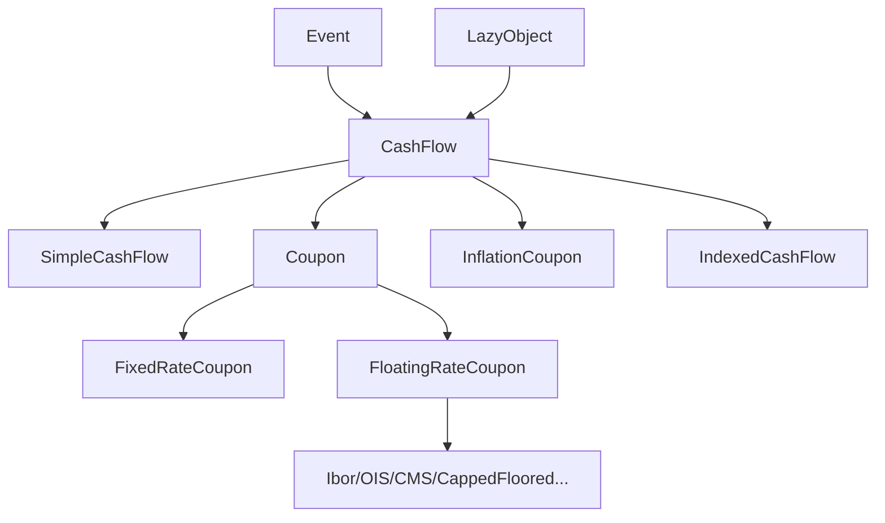

# Architecture Deep Dive

Companion to [`AGENTS.md`](../AGENTS.md). Read this when you need to understand
how pricing, notification, and cash-flow machinery fit together, rather than
just where files live.

## 1. Instrument-Engine Lifecycle

When you call `instrument.NPV()`:

1. `Instrument::calculate()` checks `isExpired()` → if expired, calls
   `setupExpired()`.
2. If `calculated_ == true` (no dependency change), cached results are reused
   immediately.
3. Otherwise, `Instrument::performCalculations()` runs the engine cycle:
   `engine_->reset()` → `setupArguments()` → `validate()` →
   `engine_->calculate()` → `fetchResults()`

Engines receive all data through the `arguments` struct and write all outputs to
the `results` struct. They never hold references to the instrument.

**Recalculation triggers** — any of these call `notifyObservers()`, ultimately
clearing `calculated_` via `LazyObject::update()`:

- **Quote value change** — `SimpleQuote::setValue()`.
- **Handle relink/forward** — `Handle<T>::Link::linkTo()` / `update()`.
- **Evaluation date change** — `Settings::evaluationDate() = newDate`, via
  `ObservableValue::operator=()`.
- **Term-structure update** — `TermStructure::update()` (sets
  `updated_ = false`).
- **Index update** — `Index::update()`.
- **Engine replacement** — `Instrument::setPricingEngine()` (re-registers the
  engine and calls `update()`).

**`calculated_` flag** (in `ql/patterns/lazyobject.hpp`): set `true` **before**
`performCalculations()` (to break bootstrap cycles), reset to `false` on
`update()` or if `performCalculations()` throws. `recalculate()` forces an
immediate recomputation.

## 2. CashFlow and Coupon Subsystem



- `CashFlow` API: `date()`, `amount()`, `hasOccurred()`, `exCouponDate()`.
- `Coupon` adds accrual data (`nominal()`, `rate()`, `dayCounter()`,
  `accrualPeriod()`).
- `FloatingRateCoupon` delegates pricing to `FloatingRateCouponPricer`
  (`ql/cashflows/couponpricer.hpp`).
- Utility analytics are in `ql/cashflows/cashflows.hpp` (`npv`, `bps`, `yield`,
  `duration`, `convexity`, `zSpread`, ...).

## 3. Design Patterns You Must Respect

- **Observer/Observable** (`ql/patterns/observable.hpp`) — market-data updates
  invalidate downstream pricing caches.
- **LazyObject** (`ql/patterns/lazyobject.hpp`) — cache plus
  recompute-on-demand behavior.
- **Handle/RelinkableHandle** (`ql/handle.hpp`) — relinking propagates
  notifications through the dependency graph.
- **Singleton** (`ql/patterns/singleton.hpp`) — process-global by default;
  per-session when sessions are enabled (`Settings`, `IndexManager`, lazy
  defaults).
- **Bridge/Pimpl** (`ql/time/calendar.hpp`, `ql/time/daycounter.hpp`) —
  swappable behavior behind stable interfaces.
- **Visitor** (`ql/patterns/visitor.hpp`) — runtime dispatch for
  payoff/instrument hierarchies.

`LazyObject` details worth remembering (`ql/patterns/lazyobject.hpp`):

- Inherits **both** `Observable` and `Observer`.
- `calculate()` sets `calculated_ = true` before `performCalculations()` to
  avoid recursive blowups.
- On exception, `calculated_` is reset to `false`.
- `update()` invalidates cache and forwards notifications per object/default
  policy.
- `freeze()`/`unfreeze()` can intentionally suppress/release notifications.
- `LazyObject::Defaults` changes apply to **newly created** lazy objects.

## 4. Module Map

```text
ql/
├── instruments/       # VanillaOption, Bond, Swap, CDS, etc.
├── pricingengines/    # Engines, organized by instrument type
│   ├── vanilla/       # ~80 engines (analytic, MC, FD, lattice)
│   ├── bond/          # Bond pricing engines
│   ├── swap/          # Swap pricing engines
│   └── ...
├── termstructures/    # Term structure hierarchy
│   ├── yield/         # FlatForward, PiecewiseYieldCurve, ZeroCurve, ...
│   ├── volatility/    # Vol surfaces (Black, local, stochastic)
│   ├── credit/        # Default probability curves
│   └── inflation/     # Inflation term structures
├── models/            # Stochastic models (HullWhite, Heston, G2, etc.)
├── processes/         # Stochastic processes (BlackScholesMerton, Heston)
├── methods/           # Lattices, finite differences, Monte Carlo
├── math/              # Math utilities
│   ├── interpolations/  # 1D/2D interpolation (linear, cubic, SABR, ...)
│   ├── solvers1d/       # Root finders (Brent, Newton, Bisection, ...)
│   └── optimization/    # Multi-dim optimization (LM, Simplex, DE, ...)
├── time/              # Date, Calendar, DayCounter, Schedule, Period
│   ├── calendars/     # ~60 market calendars
│   └── daycounters/   # Day count conventions
├── cashflows/         # CashFlow/Coupon hierarchy, pricers, leg builders
├── indexes/           # Market indexes (Ibor, OIS, inflation, equity)
├── currencies/        # Currency definitions
├── patterns/          # Design pattern implementations
├── experimental/      # Unstable/in-progress features
└── utilities/         # Null, dataformatters, tracing, etc.
```

## 5. About `ql/experimental/`

Treat `ql/experimental/*` as unstable API: useful, often production-grade in
parts, but not guaranteed to keep interface compatibility across releases.
