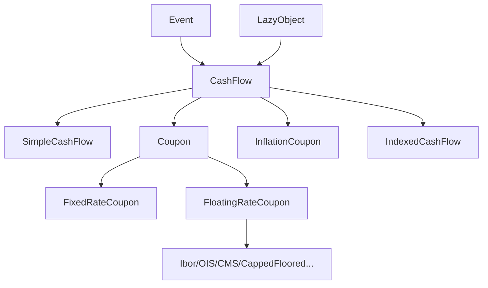

# AGENTS.md — AI Agent Guide for QuantLib

> How AI coding agents should understand, navigate, and contribute to this codebase.

## Header Metadata

- **Author**: RalfKonrad
- **License**: BSD 3-Clause (`LICENSE.TXT`)
- **Last verified against repository state:** 2026-03-20

## 1. Project Snapshot

QuantLib is a C++17 quantitative-finance library (with CI coverage through newer language modes up to C++26). It is mature, pattern-heavy, and strongly centered on lazy evaluation and observer-driven dependency propagation.

- **Primary language**: C++17 (`.clang-format` sets `Standard: c++17`)
- **Dependencies**: Boost headers (minimum checks in `configure.ac`; CMake requires newer Boost for C++20)
- **Build systems**: CMake (primary), Autotools (actively used in CI), Visual Studio solution
- **Platforms in CI**: Linux, macOS, Windows
- **Test framework**: Boost.Test (`test-suite/`)

---

## 2. Architecture Essentials

### 2.1 Core Abstractions

| Abstraction | Header | Practical Role |
|---|---|---|
| `Instrument` | `ql/instrument.hpp` | Lazy priced object holding a pricing engine and cached results. |
| `PricingEngine` | `ql/pricingengine.hpp` | `arguments`/`results` protocol; concrete engines implement `calculate()`. |
| `CashFlow` / `Leg` | `ql/cashflow.hpp` | Cash-flow primitives; `Leg` is `std::vector<ext::shared_ptr<CashFlow>>`. |
| `TermStructure` | `ql/termstructure.hpp` | Curves (yield/vol/default/inflation), observer-aware. |
| `Quote` | `ql/quote.hpp` | Observable market datum; typically consumed through `Handle<Quote>`. |

### 2.2 Instrument-Engine Lifecycle

When you call `instrument.NPV()`:

1. `Instrument::calculate()` checks `isExpired()` → if expired, calls `setupExpired()`.
2. If `calculated_ == true` (no dependency change), cached results are reused immediately.
3. Otherwise, `Instrument::performCalculations()` runs the engine cycle:
   `engine_->reset()` → `setupArguments()` → `validate()` → `engine_->calculate()` → `fetchResults()`

Engines receive all data through the `arguments` struct and write all outputs to the `results` struct. They never hold references to the instrument.

**Recalculation triggers** — any of these call `notifyObservers()`, ultimately clearing `calculated_` via `LazyObject::update()`:

| Trigger | Source |
|---|---|
| Quote value change | `SimpleQuote::setValue()` |
| Handle relink/forward | `Handle<T>::Link::linkTo()` / `update()` |
| Evaluation date change | `Settings::evaluationDate() = newDate` → `ObservableValue::operator=()` |
| Term-structure update | `TermStructure::update()` (sets `updated_ = false`) |
| Index update | `Index::update()` |
| Engine replacement | `Instrument::setPricingEngine()` (re-registers and calls `update()`) |

**`calculated_` flag** (in `ql/patterns/lazyobject.hpp`): set `true` **before** `performCalculations()` (to break bootstrap cycles), reset to `false` on `update()` or if `performCalculations()` throws. `recalculate()` forces an immediate recomputation.

### 2.3 CashFlow and Coupon Subsystem



- `CashFlow` API: `date()`, `amount()`, `hasOccurred()`, `exCouponDate()`.
- `Coupon` adds accrual data (`nominal()`, `rate()`, `dayCounter()`, `accrualPeriod()`).
- `FloatingRateCoupon` delegates pricing to `FloatingRateCouponPricer` (`ql/cashflows/couponpricer.hpp`).
- Utility analytics are in `ql/cashflows/cashflows.hpp` (`npv`, `bps`, `yield`, `duration`, `convexity`, `zSpread`, ...).

### 2.4 Design Patterns You Must Respect

| Pattern | Location | Why It Matters |
|---|---|---|
| Observer/Observable | `ql/patterns/observable.hpp` | Market-data updates invalidate downstream pricing caches. |
| LazyObject | `ql/patterns/lazyobject.hpp` | Cache + recompute-on-demand behavior. |
| Handle/RelinkableHandle | `ql/handle.hpp` | Relinking propagates notifications through dependency graph. |
| Singleton | `ql/patterns/singleton.hpp` | Process-global by default; per-session when sessions are enabled (`Settings`, `IndexManager`, lazy defaults). |
| Bridge/Pimpl | `ql/time/calendar.hpp`, `ql/time/daycounter.hpp` | Swappable behavior behind stable interfaces. |
| Visitor | `ql/patterns/visitor.hpp` | Runtime dispatch for payoff/instrument hierarchies. |

`LazyObject` details worth remembering (`ql/patterns/lazyobject.hpp`):

- Inherits **both** `Observable` and `Observer`.
- `calculate()` sets `calculated_ = true` before `performCalculations()` to avoid recursive blowups.
- On exception, `calculated_` is reset to `false`.
- `update()` invalidates cache and forwards notifications per object/default policy.
- `freeze()`/`unfreeze()` can intentionally suppress/release notifications.
- `LazyObject::Defaults` changes apply to **newly created** lazy objects.

### 2.5 Module Map

```text
ql/
├── instruments/          # Concrete instruments (VanillaOption, Bond, Swap, CDS, etc.)
├── pricingengines/       # Pricing engines organized by instrument type
│   ├── vanilla/          # ~80 engines for vanilla options (analytic, MC, FD, lattice)
│   ├── bond/             # Bond pricing engines
│   ├── swap/             # Swap pricing engines
│   └── ...
├── termstructures/       # Term structure hierarchy
│   ├── yield/            # Yield curves (FlatForward, PiecewiseYieldCurve, ZeroCurve, etc.)
│   ├── volatility/       # Vol surfaces (Black, local, stochastic)
│   ├── credit/           # Default probability curves
│   └── inflation/        # Inflation term structures
├── models/               # Stochastic models (HullWhite, Heston, G2, etc.)
├── processes/            # Stochastic processes (BlackScholesMerton, Heston, etc.)
├── methods/              # Numerical methods (lattices, finite differences, MC)
├── math/                 # Math utilities
│   ├── interpolations/   # 1D/2D interpolation (linear, cubic, SABR, etc.)
│   ├── solvers1d/        # Root finders (Brent, Newton, Bisection, etc.)
│   └── optimization/     # Multi-dim optimization (LM, Simplex, DE, etc.)
├── time/                 # Date, Calendar, DayCounter, Schedule, Period
│   ├── calendars/        # ~60 market calendars
│   └── daycounters/      # Day count conventions
├── cashflows/            # CashFlow/Coupon hierarchy, coupon pricers, leg builders, cash-flow analysis
│   ├── coupon.hpp        # Coupon base class (accrual period, nominal, rate)
│   ├── fixedratecoupon.hpp  # FixedRateCoupon + FixedRateLeg builder
│   ├── floatingratecoupon.hpp  # FloatingRateCoupon base (index, gearing, spread)
│   ├── iborcoupon.hpp    # IborCoupon + IborLeg builder
│   ├── overnightindexedcoupon.hpp  # OvernightIndexedCoupon + OvernightLeg builder
│   ├── cmscoupon.hpp     # CmsCoupon + CmsLeg builder
│   ├── couponpricer.hpp  # FloatingRateCouponPricer, IborCouponPricer, CmsCouponPricer
│   ├── cashflows.hpp     # CashFlows utility: npv, bps, yield, duration, convexity, zSpread
│   └── simplecashflow.hpp  # SimpleCashFlow, Redemption, AmortizingPayment
├── indexes/              # Market indexes (Ibor, OIS, inflation, equity)
├── currencies/           # Currency definitions
├── patterns/             # Design pattern implementations
├── experimental/         # Unstable/in-progress features (may change without notice)
└── utilities/            # Null, dataformatters, tracing, etc.
```

### 2.6 About `ql/experimental/`

Treat `ql/experimental/*` as unstable API: useful, often production-grade in parts, but not guaranteed to keep interface compatibility across releases.

---

## 3. Coding Conventions (Condensed)

### 3.1 Formatting and Includes

Source of truth: `.clang-format`.

- 4-space indent, no tabs.
- 100-column limit.
- Namespace indentation enabled.
- Pointer/reference alignment: `T* p`, `T& x`.
- Include order: local (`"..."`) -> `<ql/...>` -> `<boost/...>` -> standard headers.

### 3.2 Naming and API Style

- Types/classes: `PascalCase`
- Functions/methods: `lowerCamelCase`
- Data members: trailing underscore (`engine_`, `calculated_`)
- Macros: `QL_UPPER_CASE`
- Prefer `const` correctness and pass heavy objects by `const&`.

### 3.3 Memory and Ownership

Use QuantLib portability aliases in `ql/shared_ptr.hpp`:

- `ext::shared_ptr<T>`
- `ext::make_shared<T>(...)`
- `ext::dynamic_pointer_cast<T>(...)`

Use `std::unique_ptr` for strict local ownership in implementations.

### 3.4 Error Handling

Use `ql/errors.hpp` macros (not raw `throw`/`assert`):

- `QL_REQUIRE`
- `QL_ENSURE`
- `QL_FAIL`
- `QL_ASSERT`

### 3.5 Header Pattern

New headers should have:

- Standard QuantLib license block
- Doxygen `\file` and brief
- Include guard `quantlib_<name>_hpp`
- Self-contained includes

---

## 4. Build and Test (Validated)

### 4.1 CMake (Recommended)

```bash
mkdir build && cd build
cmake .. -GNinja -DCMAKE_BUILD_TYPE=Release -DQL_BUILD_TEST_SUITE=ON -DQL_BUILD_EXAMPLES=ON
cmake --build .
```

Preset example (exists in `CMakePresets.json`):

```bash
cmake --preset linux-gcc-ninja-release
cmake --build build/linux-gcc-ninja-release
```

Key CMake options from `CMakeLists.txt`:

- `QL_BUILD_TEST_SUITE` default `ON`
- `QL_BUILD_EXAMPLES` default `ON`
- `QL_ENABLE_PARALLEL_UNIT_TEST_RUNNER` default `OFF`
- `QL_COMPILE_WARNING_AS_ERROR` default `OFF`
- `QL_USE_STD_CLASSES` default `OFF`

Note: CI often overrides defaults (for example, `QL_COMPILE_WARNING_AS_ERROR=ON` in CMake workflows/presets).

### 4.2 Autotools

```bash
./autogen.sh
./configure --with-boost-include=/path/to/boost
make -j 4
```

Frequently used configure flags (`configure.ac`):

- `--enable-unity-build`
- `--enable-intraday`
- `--enable-std-classes`
- `--enable-thread-safe-observer-pattern`
- `--enable-sessions`
- `--enable-openmp`
- `--enable-parallel-unit-test-runner`

### 4.3 Visual Studio / MSVC

- Open `QuantLib.sln` and build desired config/platform, or use `msbuild`.
- Ensure Boost include path is configured (for example via `Build.props`, see `.ci/VS2022.props`).

### 4.4 Running Tests

```bash
# CMake build tree (run from build/)
./test-suite/quantlib-test-suite --log_level=message

# Autotools build from repo root
./test-suite/quantlib-test-suite --log_level=message

# CMake after install may expose binary in PATH
quantlib-test-suite --log_level=message

# Specific suite (run from build/)
./test-suite/quantlib-test-suite --run_test=EuropeanOptionTests

# CTest path
ctest -V
```

### 4.5 CI Reality Check

Workflows are under `.github/workflows/`. Core validation files include:

- `linux.yml`, `macos.yml`, `msvc.yml`, `cmake.yml`
- `tidy.yml`, `headers.yml`, `filelists.yml`

For portability-sensitive changes, also check non-default matrices such as:

- `linux-nondefault.yml`, `linux-full-tests.yml`, `msvc-nondefault.yml`, `cmake-latest-runners.yml`

Automation workflows (e.g., generated headers/includes/namespaces/copyright)
also exist and can change over time; header/file-list touches should stay green in
`generated-headers.yml`, `includes.yml`, and `filelists.yml`.

---

## 5. Extending QuantLib Safely

### 5.1 Registering New Files in the Build Systems

Every new `.hpp` or `.cpp` file must be added to **all three** build systems. CI enforces consistency via `tools/check_filelists.sh` (run by `.github/workflows/filelists.yml`), which diffs the actual source tree against every build-system file list and fails on any mismatch.

#### CMake

Add entries to explicit lists in `ql/CMakeLists.txt` (paths relative to `ql/`):

- Headers → `set(QL_HEADERS ...)` — e.g. `instruments/myinstrument.hpp`
- Sources → `set(QL_SOURCES ...)` — e.g. `instruments/myinstrument.cpp`

For test files, use `test-suite/CMakeLists.txt`:

- Test sources → `set(QL_TEST_SOURCES ...)`
- Test headers → `set(QL_TEST_HEADERS ...)`

#### Autotools

Each subdirectory under `ql/` has its own `Makefile.am`. Add to the one matching your file's directory:

- Headers → `this_include_HEADERS` variable
- Sources → `cpp_files` variable

For test files, use `test-suite/Makefile.am`:

- Test sources → `QL_TEST_SRCS`
- Test headers → `QL_TEST_HDRS`

#### Visual Studio

Add entries to `QuantLib.vcxproj` (paths use backslashes, relative to repo root):

- Headers → `<ClInclude Include="ql\path\myfile.hpp" />`
- Sources → `<ClCompile Include="ql\path\myfile.cpp" />`

And add matching entries in `QuantLib.vcxproj.filters` so files appear in the correct Solution Explorer folder:

```xml
<ClInclude Include="ql\instruments\myinstrument.hpp">
  <Filter>instruments</Filter>
</ClInclude>
<ClCompile Include="ql\instruments\myinstrument.cpp">
  <Filter>instruments</Filter>
</ClCompile>
```

For test files, update `test-suite/testsuite.vcxproj` and `test-suite/testsuite.vcxproj.filters` analogously (test paths are relative to `test-suite/`, filter is typically `Source Files` or `Header Files`).

#### Local Verification

Run the same check CI uses:

```bash
./autogen.sh && ./configure && ./tools/check_filelists.sh
```

### 5.2 New Instrument

1. Add instrument class in `ql/instruments/` (override `isExpired()`, implement `setupArguments()`/`fetchResults()`).
2. Add engine in `ql/pricingengines/<domain>/` using `GenericEngine<arguments, results>`.
3. Add tests in `test-suite/`.
4. Register all new files per §5.1.

### 5.3 New Term Structure

- Inherit appropriate base (yield/vol/default/inflation).
- Implement required `*Impl()` method.
- Choose fixed-date or moving-date reference mode.
- Register with dependent handles.

### 5.4 New Calendar/DayCounter

- Calendar: add impl in `ql/time/calendars/` with `name()` and `isBusinessDay()`.
- DayCounter: add impl in `ql/time/daycounters/` with `dayCount()` and `yearFraction()`.

### 5.5 Experimental Work

Prefer `ql/experimental/<topic>/` for unstable/new APIs, but keep coding quality and tests high.

---

## 6. High-Impact Pitfalls

### 6.1 Global Settings

- `Settings::evaluationDate()` is global by default; with sessions enabled it becomes per-session/per-thread.
- Use `SavedSettings` in tests to avoid leakage across cases.

### 6.2 Lazy Evaluation Surprises

- Notification forwarding behavior can differ (default/per-object, compile-time macro influence).
- Cycle handling can be silent unless `QL_THROW_IN_CYCLES` is enabled.
- Misused `freeze()` can leave stale values.

### 6.3 Handles and Lifetimes

- `Handle<T>` defaults to `registerAsObserver=true`.
- If a handle does not own the pointee safely, observer callbacks can outlive valid memory.
- Relinking `RelinkableHandle` can trigger broad recalculation cascades.

### 6.4 Dates and Conventions

- 30/360 variants differ materially.
- Actual/Actual ISMA requires schedule context for irregular periods.
- `Calendar::isEndOfMonth()` is business-day aware, not raw month-end.

### 6.5 Numerical Robustness

- Prefer robust solvers (often Brent) when derivatives are unavailable/noisy.
- Set realistic tolerances and max evaluations.
- Validate implied-vol and calibration outputs against known references.

### 6.6 Type Alias Nuance

`ql/types.hpp` aliases are macro-backed (`QL_REAL`, `QL_INTEGER`, `QL_BIG_INTEGER` in `ql/qldefines.hpp`) and configurable; do not hard-code assumptions beyond defaults.

---

## 7. Validation Checklist for Agents

Before finishing a change:

- [ ] Build passes with no new warnings.
- [ ] Relevant tests pass.
- [ ] New behavior has tests.
- [ ] Build lists are updated where needed (`ql/*`, `test-suite/*`).
- [ ] Visual Studio project/filter files are updated for new files (`QuantLib.vcxproj*`, `test-suite/testsuite.vcxproj*`).
- [ ] Headers are self-contained.
- [ ] Error handling uses `QL_*` macros.
- [ ] Pointer types use `ext::shared_ptr` conventions where appropriate.
- [ ] Numerical tolerances are justified for quant outputs.

For source-of-truth verification, consult:

- `.github/workflows/{linux,linux-nondefault,linux-full-tests,macos,msvc,msvc-nondefault,cmake,cmake-latest-runners}.yml`
- `CMakeLists.txt`, `CMakePresets.json`, `configure.ac`
- `test-suite/CMakeLists.txt`, `test-suite/Makefile.am`
- `.clang-format`, `.clang-tidy`

---

## 8. Quick Reference (Read First)

- `ql/instrument.hpp` — Instrument lifecycle and engine calls
- `ql/pricingengine.hpp` — Engine interface and generic engine
- `ql/cashflow.hpp` — CashFlow and `Leg`
- `ql/cashflows/coupon.hpp`, `ql/cashflows/floatingratecoupon.hpp`, `ql/cashflows/couponpricer.hpp`
- `ql/cashflows/cashflows.hpp` — Leg analytics
- `ql/termstructure.hpp` — Curve base
- `ql/settings.hpp` — Global settings and evaluation date
- `ql/patterns/lazyobject.hpp`, `ql/patterns/observable.hpp`
- `ql/handle.hpp` — Handles and relinking
- `ql/errors.hpp`, `ql/shared_ptr.hpp`, `ql/types.hpp`, `ql/qldefines.hpp`

---

## 9. Keep This File Lean

Update `AGENTS.md` when build/test entry points, workflow files, major conventions, or core architecture references change.

Recommended cadence:

- quick check before release candidates
- deeper full pass quarterly
